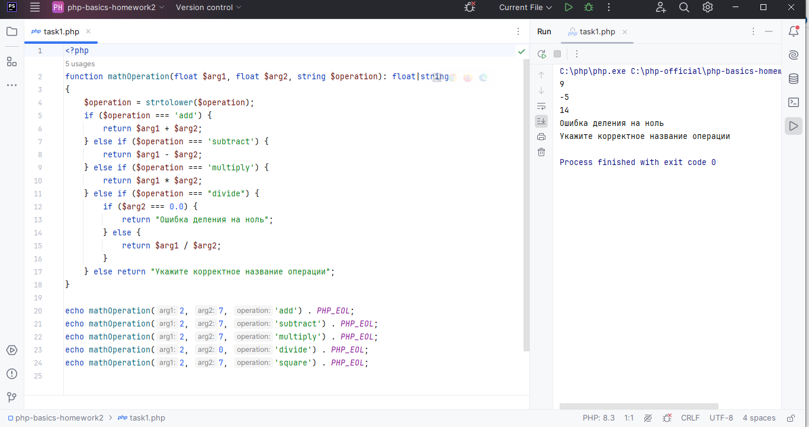
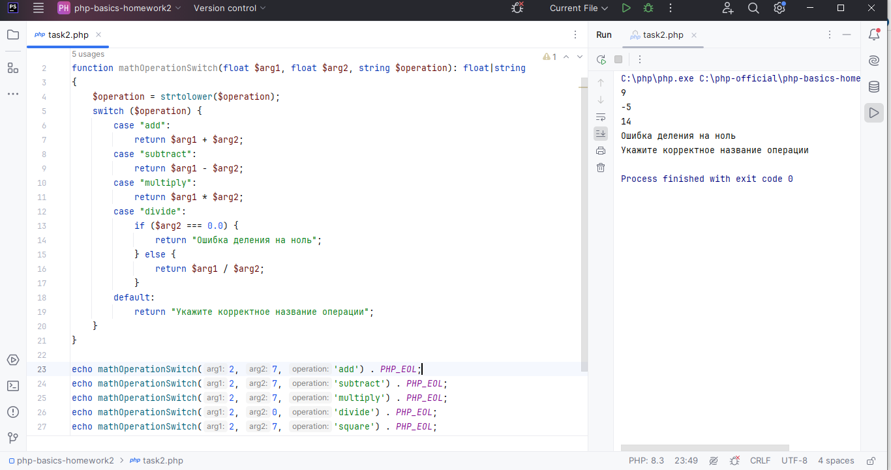
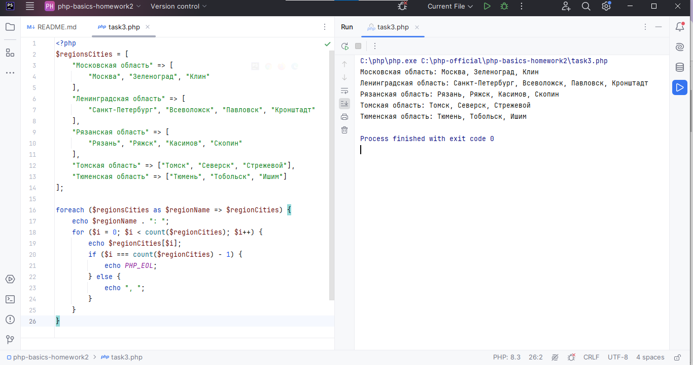
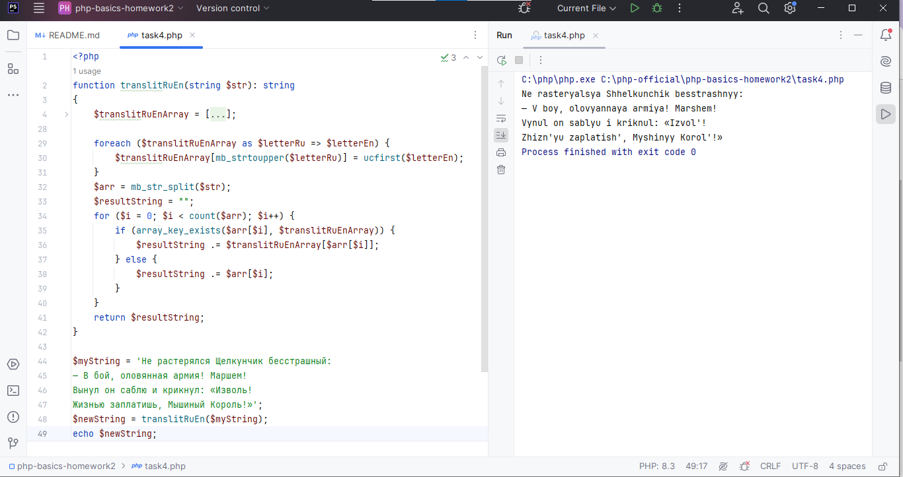
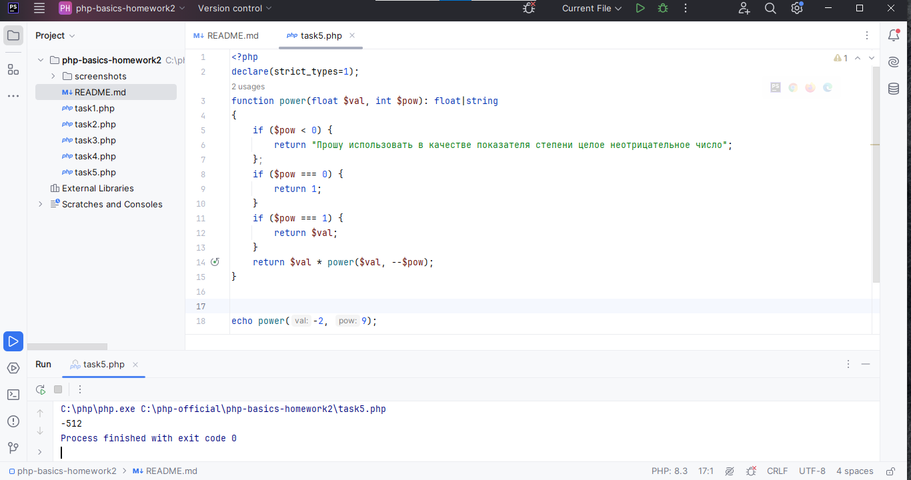

# PHP BASICS. Workshop 2. Homework. Тогочакова Евгения

### Задание 1. Реализовать основные 4 арифметические операции в виде функции с тремя параметрами – 
### два параметра это числа, третий – операция. Обязательно использовать оператор return.

[Code](./task1.php)

### Задание 2. Реализовать функцию с тремя параметрами: function mathOperation($arg1, $arg2, $operation), 
### где $arg1, $arg2 – значения аргументов, $operation – строка с названием операции. 
### В зависимости от переданного значения операции выполнить одну из арифметических операций 
### (использовать функции из пункта 1) и вернуть полученное значение (использовать switch).

[Code](./task2.php)

### Задание 3. Объявить массив, в котором в качестве ключей будут использоваться названия областей, 
### а в качестве значений – массивы с названиями городов из соответствующей области. Вывести в цикле 
### значения массива, чтобы результат был таким: Московская область: Москва, Зеленоград, Клин 
### Ленинградская область: Санкт-Петербург, Всеволожск, Павловск, Кронштадт 
### Рязанская область … (названия городов можно найти на maps.yandex.ru).

[Code](./task3.php)

### Задание 4. Объявить массив, индексами которого являются буквы русского языка, а значениями – 
### соответствующие латинские буквосочетания (‘а’=> ’a’, ‘б’ => ‘b’, ‘в’ => ‘v’, ‘г’ => ‘g’, …, 
### ‘э’ => ‘e’, ‘ю’ => ‘yu’, ‘я’ => ‘ya’). Написать функцию транслитерации строк.

[Code](./task4.php)

### Задание 5.*С помощью рекурсии организовать функцию возведения числа в степень. 
### Формат: function power($val, $pow), где $val – заданное число, $pow – степень.

[Code](./task5.php)
